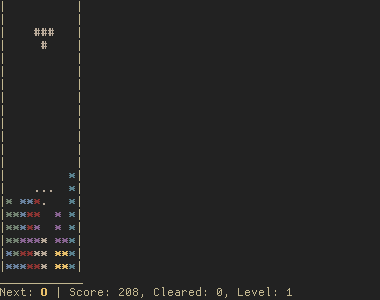

# Tetronimia
**"The only winning move is not to play"**

*That* game of falling blocky thingies.



**[Initial announcement blog post with some implementation trivia](https://indiscipline.github.io/post/tetronimia/)**

## What
- [x] Free software
- [x] Works in your terminal
- [x] Minimal
- [x] Written in [Nim](https://github.com/nim-lang/Nim)
- [x] Crossplatform
- [x] Compete with friends or foes by sharing a game seed
- [x] Colors
- [x] Optional Hold Box and Ghost piece, hard and soft drops, couple of falling speed curves.

No complicated rotation systems, no wall kicks, no music, no gui, no net usage, no telemetry, no ads, no winning.

## Why
 I don't like computer games. They:
 - Steal your time
 - Replace meaningful activity
 - Show how easy it is to manipulate a human into doing silly things
 - Deceive you into thinking you're in control
 - Disappoint you in the end

Tetronimia does all of the above. Nothing more. It's ideal. Did I mention you can't win?

## How

### Installation
Download a binary from the [release assets](https://github.com/indiscipline/tetronimia/releases/latest) or compile the game yourself.

#### Package managers
Currently, Tetronimia is available from the [AUR repository](https://aur.archlinux.org/packages/tetronimia) for Arch Linux and its derivative distros. Install with `yay` or your favourite AUR helper, such as [pakku](https://github.com/zqqw/pakku) or [paru](https://github.com/morganamilo/paru).

```
yay -S tetronimia
```

#### Building manually
Since v0.2.0, Tetronimia supports stable Nim compiler >= 1.4.6. It relies on the new official [threading](https://github.com/nim-lang/threading) package for the `Channel` implementation (earlier experimental implementation from the Nim's devel branch, on which we relied previously, was dropped). Use `choosenim` to install and manage the Nim compilation toolchain.

To install the dependencies and build with Nim's package manager Nimble:

```
git clone https://github.com/indiscipline/tetronimia
cd tetronimia
nimble build
./tetronimia -h
```

Or, you can install the dependencies in a separate pass:

```
nimble install threading cligen zero_functional
```

...and then build with Nim:

```
git clone https://github.com/indiscipline/tetronimia
cd tetronimia
nim build
```

### Playing
The game has a basic set of options, available via `--help` or `-h` argument (thanks to amazing [cligen](https://github.com/c-blake/cligen)).

The defaults are chosen to be "perfectly balanced". If you think you're not good enough, use the Hold box (`-b`, off by default). If you think otherwise, choose the nastier `-s w` speed curve, turn off the Hard Drop (`-D`), the Ghost (`-G`) and that tiny delay on line clear (`-L`). You'll suffer harder, but not for long.

## What does the name mean?
Don't try to translate it from Latin, it just pretends being it.

It has Nim and that *other thing* inside and sounds like a disease, what's more to want.

## Contributing
If you know how to shave more lines off the code without golfing or know how to port it to [CPS](https://github.com/nim-works/cps/) I'm all for that.

For other ideas, just open an issue.

## License
Tetronimia is licensed under GNU General Public License version 3.0 or later;

See `LICENSE.md` for full details.
